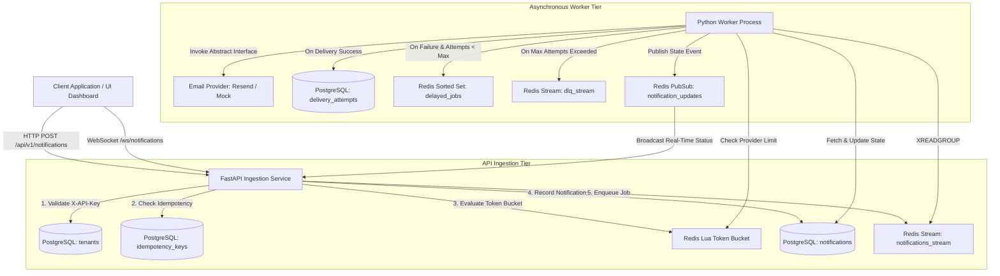

# Distributed Notification Delivery System

A production-grade, asynchronous, fault-tolerant backend system designed to ingest, rate-limit, deduplicate, and reliably deliver notifications (Email/SMS/Push) at scale with zero double-sends and real-time dashboard observability.

---

## 1. System Architecture



---

## 2. Core Technical Capabilities

### A. Idempotency (Zero Double-Sends)
- **Constraint-Backed Deduplication**: Idempotency is enforced at the database level using a unique composite index `(tenant_id, key)` on the `idempotency_keys` table.
- **Graceful Re-entry**: If a client re-submits a request with an existing `idempotency_key`, the ingestion engine bypasses queueing and returns `HTTP 200 OK` with the current status and delivery history of the existing notification without sending duplicate emails.

### B. Distributed Token Bucket Rate Limiting
- **Atomic Lua Execution**: Implemented using a custom Redis Lua script executing the **Token Bucket Algorithm**. Lua scripts run atomically inside Redis single-threaded engine, preventing race conditions across multi-instance API deployments.
- **Two-Dimensional Protection**:
  1. **Per-Tenant Limit**: Prevents single tenants from starving system resources (`HTTP 429` with `Retry-After` header).
  2. **Global Provider Limit**: Throttles worker delivery rate to comply with third-party email provider throughput limits (e.g. Resend / SendGrid rate limits).

### C. Resilient Delivery, Exponential Backoff & DLQ
- **Decoupled Workers**: Stateless Python worker processes consume jobs independently via Redis Stream Consumer Groups (`XREADGROUP`).
- **Audit Logging**: Every single delivery attempt is recorded immutably in `delivery_attempts` with error tracebacks.
- **Exponential Backoff** : Transient failures (e.g. downstream network timeouts) schedule retries with delays of 2s, 4s, 8s in a Redis Sorted Set (`delayed_jobs`). A background scheduler loop polls mature jobs and re-enqueues them.
- **Dead-Letter Queue (DLQ)**: Permanently failing jobs reaching `max_attempts` (3) transition status to `failed` and are parked in `dlq_stream` for inspection/alerting.

### D. Real-Time Observability Dashboard
- **WebSockets & Pub/Sub**: State changes (`queued` → `processing` → `delivered` / `retrying` / `failed`) publish to Redis Pub/Sub channel `notification_updates`, which FastAPI WebSocket handler streams live to the React dashboard.

---

## 3. Quick Start (Local Setup)

### Prerequisites
- Docker and Docker Compose installed.

### Step 1: Clone & Run with Docker Compose
```bash
docker-compose up --build
```
This boots 5 containerized services:
- **PostgreSQL** (`nds_postgres`: 5432)
- **Redis** (`nds_redis`: 6379)
- **FastAPI API** (`nds_api`: 8000)
- **Python Worker** (`nds_worker`)
- **React Dashboard** (`nds_frontend`: 5173)

### Step 2: Obtain Demo Tenant API Key
The `nds_seed` container automatically seeds a Demo Tenant on boot and prints the `X-API-Key` to the terminal logs:
```
============================================================
 DEMO TENANT SEEDED SUCCESSFULLY
 Tenant ID:       e7b23f...
 Tenant Name:     Demo Tenant
 X-API-Key:       nds_demo_4f8b91a2...
============================================================
```

### Step 3: Open the Dashboard
Navigate to `http://localhost:5173` in your browser.
1. Enter your `X-API-Key` in the header bar.
2. Click **"Send Test Notification"** to trigger ingestion.
3. Observe live real-time state updates moving across the pipeline!

---

## 4. Run Automated Tests

To execute the Pytest suite (testing idempotency, rate limiting, and backoff math):

```bash
docker-compose exec api pytest tests -v
```

---

## 5. Architectural Tradeoffs & System Design Interview Talking Points

### Why Redis Streams over Kafka for MVP?
- **Tradeoff**: Kafka offers durable partition-based log replayability and multi-consumer group retention, but introduces high operational setup complexity (Zookeeper/KRaft, broker clusters).
- **Decision**: Redis Streams provide identical decoupling core lessons (consumer groups, acknowledgement with `XACK`, backpressure) with zero external setup risk.
- **Next Step for 100x Scale**: Transition broker to Apache Kafka, partitioning stream topics by `tenant_id` to guarantee per-tenant ordering.

### Why Postgres DB Unique Constraint over Application Lock?
- **Tradeoff**: Application-level Redis lock `SETNX` can suffer from TTL expiration during slow DB queries, opening rare race windows for duplicate sends under high concurrency.
- **Decision**: Enforced `(tenant_id, idempotency_key)` unique constraint inside PostgreSQL ACID transactions, guaranteeing 100% mathematical zero double-sends.

### Scaling to 100x Production Volume
1. **Kafka Partitioning**: Replace Redis Streams with Kafka topics partitioned by `tenant_id`.
2. **Worker Horizontal Autoscaling**: Scale worker containers using K8s HPA based on consumer group lag metrics (`XPENDING` / Kafka lag).
3. **Multi-Region Rate Limiting**: Deploy Redis Cluster with local token bucket caches and asynchronous sync to avoid cross-region network latency.
